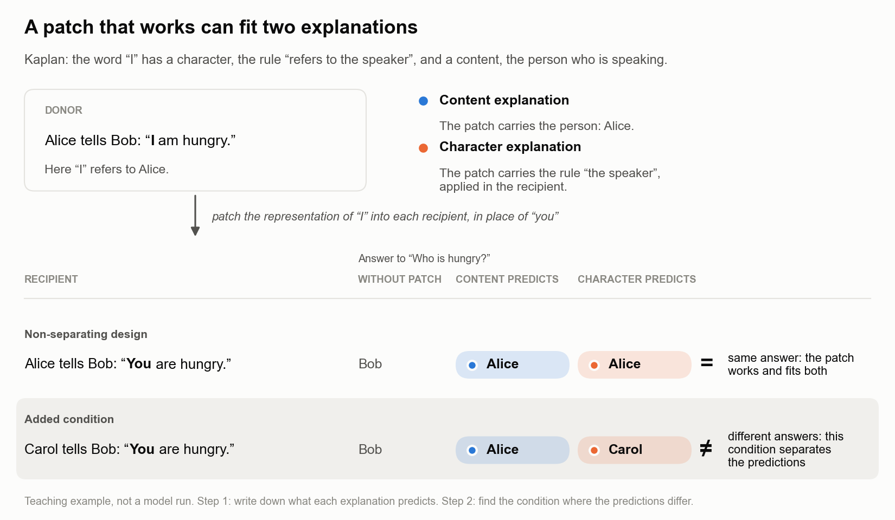

# Causal decidability: can this experiment distinguish the explanations?

A patch can change an answer exactly as expected while fitting two different causal
explanations. **Which additional condition makes their predictions differ, and can the
experiment measure that difference?** This procedure helps you answer both questions.

## Start with the confirmed example

This snapshot brings the method and its **64-pair Makelov confirmation** into one
checkout. The new verification path uses only Python's standard library: no model,
GPU, package installation or download is needed.

```bash
python3 examples/confirmed_read_source.py
```

Expected: **B wins 64 of 64 fresh base pairs**, exact sign-test `p = 1.0842e-19`.
The command checks the frozen records first, then reproduces the comparison with the
current method. It checks stored evidence; it does not rerun the model.

| Your question | Where to go |
|---|---|
| What did the experiment distinguish? | [The confirmed case, in three minutes](docs/CONFIRMED_CASE.md) |
| What happened when the method was applied again? | [Round 2: the executed 192-pair result](docs/ROUND2_RESULT.md) — three simple profiles excluded, with a worked example |
| What would a next step toward semantic questions test? | [Plan 3: person, position and relational-query transfer](docs/PLAN3_PERSON_POSITION_ROLE.md) — review draft, with a checked structural design; no new model results |
| Why can a successful patch fit different explanations? | The illustration below, or the [executable points game](docs/WORKED_EXAMPLE.md) |
| What exactly does the check verify? | [Records-only verification](applications/makelov-2311.17030/RECORDS_ONLY.md) |
| How do I use this on my own data? | [Method and data contract](docs/USING_THE_METHOD.md) |
| What changed in this release? | [Scope, safeguards and frozen files](RELEASE_NOTES.md) |

The round-1 result is a **relative prediction comparison for two declared
explanations of a patch operation**. It is not a uniquely identified native mechanism,
an adequacy result, or a general reliability guarantee for every analysis in this repo.

The teaching example below uses Kaplan's distinction between a context-dependent
content and a rule for determining that content. It illustrates how to construct rivals;
it does not show that a model stores those parts separately. The
[semantic motivation](docs/SEMANTIC_MOTIVATION.md) gives the background.



## The method

| Step | What to do | What you obtain |
|---|---|---|
| **1. Specify the explanations.** | Declare a finite candidate set. For each candidate, specify what is transferred, what remains with the recipient, and how the output is computed. Include close alternatives such as value transfer, decision transfer and a direct output bias. | Executable rival predictions, not just names for interpretations. |
| **2. Check the design before collecting outcomes.** | Compute each candidate's predictions for every planned donor, recipient, intervention and readout. Group candidates with identical prediction patterns. Add a condition where an important unresolved pair disagrees, if one is available. | A map of the distinctions this design can and cannot make. |
| **3. Check whether the differences are measurable.** | For the separating conditions, declare the independent unit, relevant effect size, uncertainty procedure and numerical checks. Verify the implemented patch, including after dtype conversion. Freeze the predictions and evaluation rule before confirmation. | A defensible measurement plan. An invalid intervention or measurement blocks interpretation. |
| **4. Compare predictions and, if planned, assess adequacy.** | Under the frozen loss and uncertainty rule, compare candidates on paired cases. To assess adequacy, also declare a tolerance before confirmation and evaluate each candidate against it. | Relative predictive performance; with an adequacy criterion, candidate statuses and the compatible explanation set. |

**More samples cannot repair identical predictions on the chosen quantities.** A different
intervention, context or readout is needed. Conversely, different predictions do not
guarantee that a finite experiment will resolve the difference. Power and precision
planning address this second problem; they are supporting tools, not the definition of
causal decidability.

## What the answer means

**Relative comparison:** which candidate predicts better under the declared paired test?
This needs no adequacy tolerance. A supported advantage does not establish that either
candidate is accurate enough; a non-significant comparison does not establish equality.

**Adequacy:** does each candidate meet a declared accuracy requirement? Report each
candidate as adequate, excluded or undecided. The compatible set contains every candidate
not excluded; its possible outcomes are:

| Output | Interpretation |
|---|---|
| One group remains | The declared alternatives outside that group are excluded under the evaluation rule. Members of the group remain indistinguishable here. |
| Several, but not all, groups remain | The experiment narrows the explanation set. |
| All groups remain | These data do not discriminate among the declared explanations. |
| No candidate remains | None of the declared explanations fits under the checked assumptions and evaluation rule. |

These statements are conditional on the candidate set, implemented intervention,
population, readout and uncertainty assumptions. Being the only candidate left does not
by itself establish adequate accuracy or a uniquely true mechanism. A failed technical
check is a separate invalid-result state, not evidence against the candidate set.

## A real-model example: distinguishing two read sources

The same experimental logic applies beyond linguistic examples: specify competing
explanations, then introduce an intervention on which their predictions differ.
Here the rivals concern two read sources in a GPT-2 Small patch, not Kaplan's concepts.
Both reproduce the measured full-patch effect by construction. Two additional read
interventions separate their predictions while keeping the write direction fixed.


On **64 fresh base pairs**, candidate B had lower absolute prediction error in every
pair under the preregistered comparison (exact two-sided sign test, p = 1.1e-19). This confirms
the relative comparison; no adequacy tolerance was declared, so it does **not** establish
that B is accurate enough or return a confirmed compatible set. See the
[evidence map](docs/EVIDENCE_MAP.md) for the protocol, results and limits.

The patch can read information that the immediate native output projection would not
transmit and write it into a visible direction. This is why explaining the patch's
effect is different from showing that the unmodified model naturally uses that source.

## Apply the method again: the next unresolved distinction

| Round | Question | Status |
|---|---|---|
| **1. Read source** | Which source better predicts the patch's effect? | **Confirmed comparison:** null-read candidate wins 64/64 fresh pairs. |
| **2. Query reset and reverse transfer** | Does resetting selected queries remove the effect, and can those queries reproduce it alone? | **Executed:** all three predefined profiles excluded on 192 fresh pairs; all numerical and technical controls passed. |
| **Later: native computation** | Does the unmodified model use that information in the same way? | **Open:** neither preceding comparison settles this. |

The first result survives even if the next test is inconclusive or rejects the new
candidates. Each round applies the same steps—specify rivals, find disagreement, check
resolution, compare on fresh cases—to a narrower unresolved question.

Read the [actual second-round result](docs/ROUND2_RESULT.md), or run:

```bash
python3 examples/iterative_query_transfer.py  # constructed worlds; actual shipped analyzer
```

The [execution protocol](applications/makelov-2311.17030/QUERY_ROUTE_PROTOCOL.md)
records the frozen contract. The [earlier walkthrough](docs/ITERATIVE_IDENTIFICATION.md)
preserves the design history, including the missing condition found during review.
This route question is separate from Q1's still-open adequacy question.

## What data are needed?

**For the structural check:** candidate rules and a table of planned experimental
conditions. No model forwards are needed when the predictions follow analytically.

**For an empirical application:** identified independent cases; paired baseline and
intervention outputs; all declared control conditions; the actual hook, layer and token
positions; and model, code, dtype and data provenance. Preserve per-case results rather
than only aggregate means. Pilot data may estimate unknown quantities, but their role and
uncertainty must be explicit and confirmation data kept separate.

## Connection to causal abstraction

[Geiger et al.](https://www.jmlr.org/papers/v26/23-0058.html) formalize when an aligned
high-level causal model reproduces low-level outcomes under corresponding interventions,
exactly or approximately. This procedure asks a complementary question: **does the
particular intervention design distinguish that high-level explanation from its rivals?**
Agreement with one explanation need not exclude another. This is an experimental
identification check, not a replacement for causal abstraction or a guarantee of unique
mechanistic truth.

## Apply it

Use the [technical guide](docs/USING_THE_METHOD.md) for the formal definition, function map,
input format and commands for your own data. The [worked example](docs/WORKED_EXAMPLE.md)
shows a prediction table you can check by hand; [validation details](docs/validation.md)
report where the planning calculator succeeds and where it falls short.

## Install and run

```bash
git clone --branch codex/round2-critical-plan https://github.com/Satori-1618/causal-decidability-method-case.git
cd causal-decidability-method-case
python3 examples/confirmed_read_source.py       # confirmed 64-pair result; standard library only
python3 examples/iterative_query_transfer.py    # synthetic illustration of the second-round design
python3 examples/twelve_cell.py                 # steps 1, 2 and 4 on a toy you can check by hand
python3 examples/from_data.py --compare-only    # optional DEVELOPMENT pilot: 32 pairs, not Q1
python3 -m pip install -e '.[test]'              # only needed for installation and tests
python3 -m pytest                               # offline release tests; no model downloads
```

## Applications

The [Makelov application](applications/makelov-2311.17030/RECORDS_ONLY.md) is included
here, with byte-identical historical experiment files and an additional records-only
checker. No branch switch is needed. Its original README describes the broader archive;
start with the records-only guide for the small confirmed case.

| paper | location | status |
|---|---|---|
| Makelov, Lange & Nanda, arXiv:2311.17030 | [Q1](applications/makelov-2311.17030/RECORDS_ONLY.md), [round 2](docs/ROUND2_RESULT.md) | confirmed read-source comparison; 192-pair query-route profile exclusion; older material preserved |

The synthetic calculator benchmark and other application branches belong to the
development repository and are not included in this public snapshot. Their reported
limitations remain in [validation.md](docs/validation.md); they are not the empirical
foundation of the Q1 result. See [applications/](applications/README.md) for templates.

## Layout

```
docs/USING_THE_METHOD.md   technical guide: definition, function map, planning calculator, your own data
docs/WORKED_EXAMPLE.md     the twelve-cell toy, step by step
docs/EVIDENCE_MAP.md       what the existing applications establish, and what not
docs/ITERATIVE_IDENTIFICATION.md  the next application, from signal source to route
docs/validation.md         the calculator's validation, with its failures
docs/SEMANTIC_MOTIVATION.md how context suggests rivals, without assuming a neural decomposition
docs/RESEARCH_SCOPE.md     the research priority
src/causal_decidability/   design.py (step 2), calculator.py and paired.py (step 3),
                           compatible_set.py and evaluate.py (step 4), cli.py
examples/                  twelve_cell.py, from_data.py and the stored data
applications/              index, protocol, preregistration template
tests/                     python3 -m pytest tests
```

## Lineage

- A. C. Atkinson and V. V. Fedorov (1975). The design of experiments for discriminating
  between two rival models. *Biometrika* 62(1).
- B. Mélykúti, E. August, A. Papachristodoulou and H. El-Samad (2010). Discriminating
  between rival biochemical network models: three approaches to optimal experiment design.
  *BMC Systems Biology* 4:38.
- A. Geiger et al. (2025). Causal abstraction: a theoretical foundation for mechanistic
  interpretability. *JMLR* 26.
- M. Méloux et al. (2025). Everything, everywhere, all at once: is mechanistic
  interpretability identifiable? arXiv:2502.20914.

## Licence and citation

By Felix Borck, under the [MIT licence](LICENSE). The licence covers the files in this
repository; files an application fetches from upstream keep their own terms and are not
included. To cite, use [CITATION.cff](CITATION.cff).
