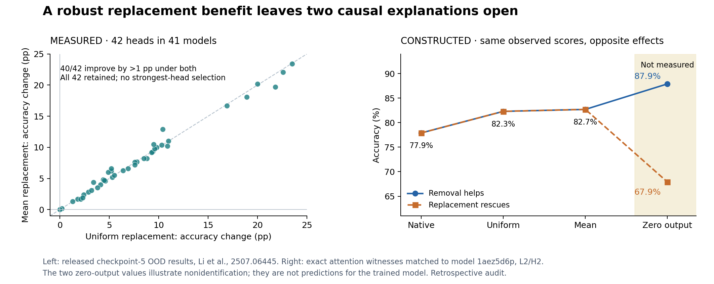

# Better after ablation — better because of what?

**The published improvement is robust. Its decomposition is not identified.**
In Li, Saphra and colleagues' Dyck-1 models, replacing a sign-matching head's
attention improves OOD accuracy for 40 of 42 heads by more than one percentage
point, under **both** uniform and dataset-mean replacement. These observations
do not determine whether zeroing the native head output would help or hurt.

This is a **retrospective, local application** of the causal-explanation
preflight to [§4.3 and Appendix J of the paper](https://arxiv.org/html/2507.06445v4#S4.SS3).
The authors already report predictive/causal dissociation and both replacement
controls. We reproduce their evidence and make one remaining inference boundary
executable; we do not refute that finding or claim to identify a native mechanism.



## A real example, followed by two explicit explanations

Released model `1aez5d6p`, checkpoint 5, layer 2/head 2; 1,000 OOD strings:

| Intervention on that head | Published accuracy | What the code does |
|---|---:|---|
| Native attention | 77.9% | Uses the input's attention-weighted values |
| Uniform attention | 82.3% | Replaces the weights; continues to transmit values |
| Dataset-mean attention | 82.7% | Replaces the weights by their mean; continues to transmit values |
| Zero head output | **Not reported** | Would remove this head's value mixture at all query positions |

The example is the lexicographically first head with both improvements above 1 pp,
selected **after** reading the data for illustration. It supports no confirmatory
claim. The analysis keeps every head, including weak and zero effects.

Let `a0` be accuracy with the head output set to zero, `aN` native accuracy,
and `aU` accuracy with uniform replacement. The following identity is exact:

**`aU − aN = (a0 − aN) + (aU − a0)`**

The first term is removal relative to a specified zero reference; the second is
the contribution of adding the replacement relative to that reference. No linear
network assumption is needed for this decomposition of three outcome values.
The same identity holds for mean replacement.

| Rival | Native, uniform and mean observations | Additional zero-output condition |
|---|---|---|
| **Removal helps:** the native contribution hurts relative to zero | Can match all three published accuracies | `a0 > aN` |
| **Replacement rescues:** removal hurts, but the replacement more than compensates | Can also match all three accuracies | `a0 < aN` |

These are operational causal claims about a **fixed zero reference**, not complete
semantic explanations. A zero effect, mixtures, and insufficient resolution remain
possible; the pair is not an exhaustive mechanism inventory.

## What the method adds

1. **Reproduce the relevant controls.** All 1,620 heads in 270 released models
   pass the source/join checks; the paper's multilayer comparison has 1,350 heads
   in 180 models. Among its 42 sign-matching heads in 41 models, 41 improve under
   each replacement, one is unchanged, and the same 40 exceed 1 pp under both.
   Average gains are **+7.97 pp uniform / +8.00 pp mean** with equal head weights,
   or **+8.02 / +8.06 pp** when each model receives equal weight. The difference
   does not require selecting each model's strongest ablation.
2. **Exhibit the ambiguity.** Two small attention models reproduce the example's
   three accuracies exactly, with identical per-case predictions across the two
   models in those conditions. In one, zeroing gives **87.9%**; in the other,
   **67.9%**. These two zero scores are **constructed witnesses, not forecasts**
   for the released neural model. They show that the measured improvements alone
   do not determine the sign of the removal effect.
3. **Specify the missing intervention class.** The witnesses remain identical
   under **any row-normalized attention-weight replacement**: a constant shift
   in every value can be offset downstream. Another normalized replacement, more
   repeated forwards, or a more precise estimate of the same measurements cannot
   distinguish this pair. A zero-output condition does distinguish them.

The existing method calculator is used unchanged: the two exact witnesses form
one prediction group under the three existing conditions and two groups when
the zero-reference condition is added. See the generated
[countermodel results](results/countermodels.json) and the
[derivation and proposed next intervention](IDENTIFICATION.md).

**What survives:** these replacement patterns outperform the native patterns on
the measured OOD set. **What remains open:** whether the original head output
helps or hurts relative to zero, and which semantic computation explains that
effect. The paper's main predictive result is not challenged.

## Reproduce locally

From the repository root, standard-library Python 3.9+:

```bash
python3 -B -S applications/li-saphra-2507.06445/analyze.py --check
python3 -B -S applications/li-saphra-2507.06445/verify_independently.py
python3 -B -S -m unittest discover -s applications/li-saphra-2507.06445/tests -v
```

The first command reconstructs the stored results and runs the existing preflight;
the second independently reads the raw CSVs and checks the central numbers and
countermodels without importing the producer. No model, installation, or network
is needed. If upstream files are absent, `python3 .../fetch.py` retrieves only the
12 files in [SOURCE_LOCK.json](SOURCE_LOCK.json), from the fixed commit, and checks
their hashes. Upstream code is included for inspection and is **not executed**.

For new output construction, `python3 .../analyze.py` writes missing results and
refuses to overwrite different existing results. To redraw the figure, use
`python3 .../plot.py` with Matplotlib installed.

## Scope and evidence

- Source: [public repository at `dedb269e`](https://github.com/vli31/id-predict-ood/tree/dedb269eca6a9cf0bc409792003e6f815f2dce34).
  [Protocol](PROTOCOL.md), [machine-readable summary](results/summary.json),
  [all head records](results/heads.csv), [provenance](results/manifest.json).
- This is **stored-data reconstruction**, not a new model replication, fresh
  confirmation, or a measured zero-ablation result. Cross-producer native
  accuracies agree in all 270 models; that does not certify tensor fidelity or
  cross-precision stability.
- These are descriptive finite-set results. Heads share models and test inputs;
  the model sweep reuses 15 initialization/shuffle seed pairs. We report no
  heads-as-independent confidence interval, population exclusion, or power claim.
  The 1-pp band comes from upstream's descriptive convention, not a significance
  or numerical threshold; the count grid is 0.1 pp, not a numerical error bound.
- The actual primary pair is **structurally unresolved** in the outcome tables,
  even before statistical resolution. Its unspecified zero accuracy permits
  removal effects from −77.9 to +22.1 pp in the example. Synthetic point forecasts
  demonstrate ambiguity; they do not supply missing forecasts or measurement
  calibration for the neural checkpoint.
- Zeroing is a conventional reference, not a uniquely neutral absence. Changing
  value offsets and compensating elsewhere can preserve behavior under every
  normalized attention replacement but change a zero-output result. Even the
  added experiment would establish a local effect in the fixed checkpoint,
  not a representation-invariant notion of what the head "really does."
- All OOD test strings have the negative Nested label. Accuracy gains are more
  correct rejections on that set, not by themselves evidence of an improved
  general-purpose parentheses-balancing algorithm. Same-head uniform ablation
  reduces ID accuracy by 1.00 pp on average; both distributions should be retained
  in a follow-up.

**Status: retrospective reconstruction complete; two operational causal
explanations remain compatible; the separating zero-output measurement has not
been run.**
