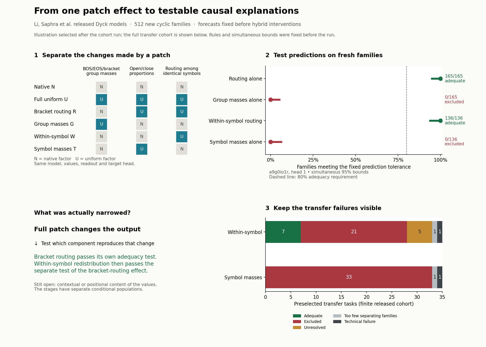

# A real-model example of successive causal narrowing

**Two explanations can fit the same patch result and disagree about the next
intervention. We recorded those disagreements, then tested them on released
transformers and new inputs.** One previously untested head passed both successive
adequacy tests; the complete cohort shows where the same accounts fail.

## The question

[Li, Saphra et al.](https://arxiv.org/html/2507.06445v4#S4.SS3) find that replacing
some heads' attention improves rejection of incorrectly nested brackets. Their
paper already separates prediction from causal evidence and includes several
replacement controls. We ask which **component of that replacement** accounts
for its effect; this complements their result.

A uniform replacement changes attention to special tokens, total attention to
open/close symbols, and attention between occurrences of the same symbol. The
original endpoints cannot separate explanations assigning the effect to these
different components. The additional interventions change them separately while
keeping the model, values and readout fixed.

## A concrete two-step result

For released checkpoint **`a9g0io1r`, layer 2/head 1**, each stage tested two
opposite predictions about previously unmeasured interventions:

| Step | Account predicting the new interventions | Matched families | Simultaneous bound on match rate | Competing account |
|---|---|---:|---:|---|
| 1 | Bracket routing reproduces full uniform; group-mass change reproduces native | **165/165** | **94.89–100%** | Group masses alone: 0/165, upper 5.11% |
| 2 | Redistribution between identical symbols reproduces bracket routing; symbol-mass change reproduces native | **136/136** | **93.83–100%** | Symbol masses alone: 0/136, upper 6.17% |

A match requires **both new margins on all three members of a family** to be
within 0.25 nat of their predictions, with a numerical allowance. Adequacy requires
a lower bound above 80%. Each stage conditions on a sufficiently separated
endpoint effect; their populations and tolerances are separate. This is not a
claim that their composition has the same 0.25-nat error bound.

This head was selected **after the cohort run for illustration**. The task list,
prediction rules, tolerance and simultaneous bounds across all tasks were fixed
before execution. The original development checkpoint separately passed stage 2
on **183/183** fresh separating families; its stage-1 adequacy remained unresolved.

**What this establishes:** for these tested interventions, information carried
by different occurrences of the same bracket symbol matters. Merely changing
the total weight on open versus close symbols is insufficient. Which contextual
or positional information those values encode remains open.

## Keep the complete result in view

There were **35 transfer head–model tasks in 34 two-layer models**, plus the
development checkpoint, tested on 512 new length-32 cyclic families. Each family
contains one valid and two invalid equal-count strings. These are new evaluation
families, not a guarantee of absence from the original training stream.

| Stage-2 outcome | Within-symbol account | Symbol-mass account |
|---|---:|---:|
| Adequate | 7 | 0 |
| Excluded | 21 | 33 |
| Unresolved | 5 | 0 |
| Too few separating families | 1 | 1 |
| Technical invalidity | 1 | 1 |

In stage 1, routing alone was adequate for **one** transfer task and excluded for
33; group masses alone were excluded for all 34 technically complete tasks.
Thus this is a local positive result with substantial transfer failures, not a
universal explanation of sign-matching heads. Both simple accounts failing
leaves mixed or context-dependent effects; it does not identify a third mechanism.

The original run stopped on one rounding-sensitive ordinal control. Its failure
was retained; a documented continuation completed the unchanged cohort with the
same thresholds and multiplicity correction. The diagnosis found one float32
rank gap of 1.86e-9 becoming a tie, with no float64 mismatch. That task remains
invalid. [Protocol](CONFIRMATION.md) · [amendment](CONTINUATION.md) ·
[independent code-path audit](VERIFICATION.md) · [all decisions](results/confirmation_report.json).

## What the method contributed

It turned an aggregate patch effect into **conditional forecasts that could fail**,
selected interventions separating those forecasts, and assessed absolute adequacy
on new cases. The retained explanation became more specific in the successful
case, while the same rules refused that explanation elsewhere. Relative prediction
quality alone was never treated as identification.

This is an executable prospective case study. It does **not** establish superior
performance over a competent researcher using the same factorial design, a new
general identification theorem, or a complete native algorithm. Component changes
also have different sizes: the study decomposes this replacement, rather than
comparing equal-dose intrinsic importance. The authors already consider special-
token statistics; the added test separates their causal contribution.

## Reproduce or adapt

Start with [the short practical example](EXAMPLE.md). [REPRODUCE.md](REPRODUCE.md)
gives the commands, software environment, hashes and raw-result bundle.
To adapt the logic: name the distinct quantities your patch changes, construct
valid interventions changing each separately, write rival predictions **before**
measuring those cells, and retain uncertainty or reject the candidate set when
neither prediction is adequate. Do not assume that our thresholds or operators
transfer to another model or task.
