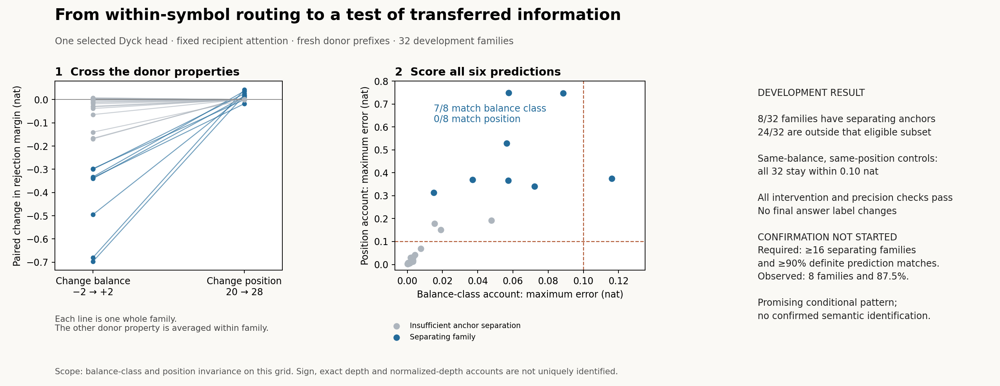

# What information is transferred: prefix balance or position?

**Status: completed development; confirmation not started.** The new intervention
works, and the data favor a balance-class pattern over the declared position
pattern on the eight separating families. The predefined confirmation gate was
not met. This does not change the earlier confirmed intervention-decomposition
results.

**Next iteration:** a separately frozen [prospective margin-screen test](screen_002/README.md)
found separating outcomes in **30/32 accepted versus 0/32 rejected fresh
families**. Its balance-class fit was **19/30**, so the mechanism-development
gate still failed. This validates the screen locally and leaves the earlier
development result below unchanged.

**Next experiment, prepared but not run:** [transfer the screen to six fixed heads](screen_transfer_003/README.md),
with a fixed screening budget, a random-yield/cost comparison and a separate
averaged-anchor specification. The reviewed plan now uses 64 families per stratum;
the frozen runner and inputs await final pre-run review, and
no execution is authorized.

## Why this is the next method iteration

The [previous round](../native_followup/README.md) established that redistribution
between occurrences of the same bracket can explain an attention-replacement
effect. It left open what makes those occurrences different. This round asks
whether **the effect of their transferred values is stable at the same prefix
balance, or at the same absolute position**.

At one previously successful head (`a9g0io1r`, layer 2/head 1), we transfer one
observed donor-value contribution into a fixed recipient. Attention and the rest
of the computation stay unchanged. This is a new intervention, with its own
technical validation; it is not a reanalysis of the preceding outcomes.

The donor grid crosses current prefix balance **−2/+2** with position **20/28**.
Every donor has the same target symbol `)`, length 32 and 16 brackets of each
kind. Its prefix minimum is exactly −4 through the target, so all donors have
already violated nesting. Each grid cell has two different prefix sequences.
Different suffixes are not treated as fresh donor information.

## Predictions, then observations

Two diagonal anchor transfers calibrate both candidates. Their fixed formulas
are recorded before measuring the six remaining transfers:

- **Balance-class account:** values at the same current balance predict the
  same transferred margin across positions and prefix variants.
- **Position account:** values at the same position predict the same transferred
  margin across balances and prefix variants.

These are approximate, anchor-calibrated invariance claims. They are not
parameter-free forecasts or a complete account of the head's computation.

| Recorded development outcome | Result |
|---|---:|
| Whole recipient–donor families | 32 |
| Separating families: anchor difference >0.202 nat | 8 |
| Balance-class prediction matches, eligible families | **7/8** |
| Position prediction matches, eligible families | **0/8** |
| Same balance and position, different prefix: maximum margin difference | **0.07257 nat** |
| Maximum fp32/fp64 prediction-error discrepancy | **0.00000308 nat** |
| Families with any final answer-label change | **0/32** |

A match requires **all six target margins** to lie within the declared 0.10-nat
tolerance, with a 0.001-nat numerical allowance. The other 24 families do not meet
the predefined anchor-separation rule and are not counted as successful
discrimination. Their measurements remain visible. The effects concern output
scores; no claim of changed answer labels is made.

The gate required at least **16/32** separating families and at least **90%**
definite matches for one candidate. We observed eight and 87.5%. **No confirmation
model run was started and no confirmatory result is claimed.** Thresholds,
positions and the head were not revised after seeing the pilot.

## A concrete observed family

This is the first separating family in sorted identifier order, selected after
the run for illustration (`3f92aa4f5cb66cfed582`). Larger margins mean stronger
rejection. The recipient and its intervention site are fixed across this table:

| Donor's current balance | Donor position | First prefix | Second prefix |
|---|---:|---:|---:|
| −2 | 20 | 7.608 | 7.598 |
| −2 | 28 | 7.620 | 7.645 |
| +2 | 20 | 7.279 | 7.279 |
| +2 | 28 | 7.276 | 7.276 |

Here the margins track the donor's balance class much more closely than its
position. This is one descriptive example, not additional independent evidence.
The full 32-family table, including the failed balance-class prediction, is
preserved in [the report](results/development_report.json).

## What this adds, and what it leaves open

The round supplies a **testable semantic lead**: under controlled transfer, current
prefix class is a better coarse description of these effects than the position
pattern tested here. Same-label controls also show that the sampled prefix
variation stayed within this particular tolerance in the pilot.

There is no confirmed population adequacy claim. With only −2/+2, exact balance
and its sign remain indistinguishable; sign(d/position) has the same pattern,
and |d/position| can mimic a position pattern. More detailed context and mixed
accounts remain possible. Whole-value transfer also moves correlated features.
These limits prevent translating this result into discovery of a unique depth
variable, a complete algorithm, or a generally reliable method.

## Reproduce and inspect

- [Protocol and stopping rule](DEVELOPMENT.md), committed before outcomes as
  `66110d8`; local provenance, not an external preregistration.
- [Separate-agent pre-run review](REVIEW_PRE_RUN.md). Review is part of this
  AI-assisted workflow, not an external human review.
- [Independent verification](VERIFICATION.md) and [reproduction commands](REPRODUCE.md).
- [Prepared inputs](inputs/development_001/preparation.json),
  [raw run](results/development_001/manifest.json),
  [analysis](results/development_report.json).

The input pools exclude previously evaluated strings and prefixes; original
training overlap is unknown. The reviewer also identified a requirement for any
future confirmation: exclude both target-length prefixes from **all** development
recipient and donor strings, including across roles and positions. No such
confirmation is claimed here.
