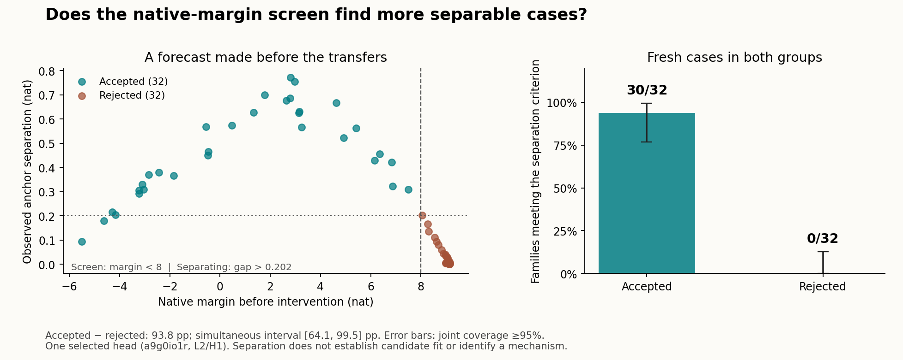

# Can a baseline predict which cases will separate two explanations?

**The frozen screen worked on fresh cases: 30/32 accepted families separated
the rivals, versus 0/32 rejected families.** The difference is **93.75 percentage
points**, with a simultaneous >=95% interval of **[64.13, 99.47] points**, above
the prespecified 25-point practical target. This validates this screen locally
on one previously selected Dyck head. The failed
[first development round](../README.md) remains unchanged.



| Separate questions | Fresh result | Frozen decision |
|---|---:|---|
| Does native margin <8 enrich for anchor-separable families? | 30/32 accepted; 0/32 rejected | Substantial enrichment supported |
| Does the balance-class account predict all six target transfers? | 19/30 separating accepted families | Development gate fails |
| Does the position account predict all six target transfers? | 0/30 | Development gate fails |

**The screen found informative cases; it did not make the explanations accurate.**
The secondary gate still requires at least 16 separating families and 90% matches
for one candidate. The observed balance-class match rate was **63.33%**. No
semantic confirmation was run, and no rule was relaxed. These secondary counts
are developmental, not new confirmatory candidate-exclusion claims.

## The useful distinction

A case can fail to distinguish explanations because their intervention
predictions are too close. That is different from obtaining a clear distinction
and discovering that neither explanation predicts it accurately. This round
tests the first question primarily and keeps the second as a separate result.

The screen uses a measurement available **before patching**: accept a recipient
when its native rejection margin is below 8 nat. We measure the same two anchor
transfers on 32 accepted and 32 rejected fresh families. The primary outcome is
whether their difference exceeds 0.202 nat, the already specified criterion for
separating the balance-class and position forecasts. A rejected case is not
declared causally irrelevant.

## How the test was fixed

- One head: `a9g0io1r`, layer 2/head 1. One operator and the original donor grid.
- 1,024 native candidates, then the first 32 in each screen group; all scores and
  selections are recorded before any anchor transfers.
- Same independent donor sampling in both groups, with prior full-string and
  cross-position donor-prefix exclusions.
- One primary difference in separation rates, with a simultaneous >=95% interval.
  A lower bound above zero supports enrichment; above 25 percentage points meets
  the stronger practical target. These decisions were fixed before outcomes.
- The six remaining transfers are measured for accepted families only. The
  earlier **16/32 separating plus 90% prediction matches** gate stays unchanged.

The screen cutoff was chosen after the first pilot. Fresh testing validates
its local enrichment, but cannot erase that development history or establish transfer to
other heads. The signed cutoff is not a general confidence rule: confidently
incorrect negative margins also pass it. It does not identify numerical balance,
its sign, a saturation mechanism or a complete circuit.

## Record and scope

Protocol, code and prepared inputs were frozen locally at **`7e808be`** before
this run. Of the 1,024 baseline candidates, 440 passed the screen and 584 did not;
only 32 per stratum were selected for the comparison. All 64 selected families
were retained. The run measured 320 intervention cells in both dtypes. Technical
controls passed, including a maximum fp32/fp64 anchor-contrast difference of
`0.00000313` nat and target prediction-error difference of `0.00000492` nat,
both below the frozen 0.001-nat allowance.

Model execution took **2.64 seconds** on CPU, after source/input checks; preparation,
implementation and review are additional. This validation deliberately measured
rejected cases and 1,024 native candidates. It does **not** demonstrate net
compute savings or justify applying the same 8-nat cutoff to other models.

The methodological result is a successful local instance of **predicting
practical separability before intervention**, distinct from predicting which
mechanistic account will fit. The procedure is reusable; this numerical cutoff
and its performance still need evaluation on untouched heads and tasks.

## Inspect and reproduce

From this directory, saved-record verification uses standard-library Python:

```bash
python3 -B -S verify_screen.py --run results/run_001 --inputs inputs \
  --report results/report.json
```

The verifier follows a separate implementation from the producer/analyzer. It
checks saved native scores, first-in-order selection, freshness, forecasts,
tensor arithmetic and both decisions. It is not an independent neural rerun;
whole-layer unchangedness is checked during production but full-layer tensors
are not archived. Historical exclusions are reconstructed from the bound
committed inventory plus the earlier development inputs; original upstream
files are also hash-checked when available. Receipts and git provenance are local,
not external timestamps.

To replay model execution, use a full git checkout and the Python/PyTorch
environment and pinned asset downloaders in [the reproduction guide](../REPRODUCE.md).
Then, from this directory:

```bash
python run_screen.py --inputs inputs --output /tmp/screen-replay-002
python analyze_screen.py --run /tmp/screen-replay-002 \
  --output /tmp/screen-replay-report.json
python -m unittest discover -s tests -v
python -m unittest discover -s . -p test_analysis_screen.py -v
```

Output paths must not already exist. A replay reuses these fixed inputs and is
not a fresh confirmation. No GPU or training is needed. Numerical gates must
pass in the replay environment; byte-identical neural outputs are not promised.

[Protocol](PROTOCOL.md) · [Power assumptions](planning.json) ·
[Prepared inputs](inputs/preparation.json) · [Pre-run review](REVIEW_PRE_RUN.md) ·
[Raw run](results/run_001/manifest.json) · [Analysis](results/report.json) ·
[Independent verification](VERIFICATION.md)
