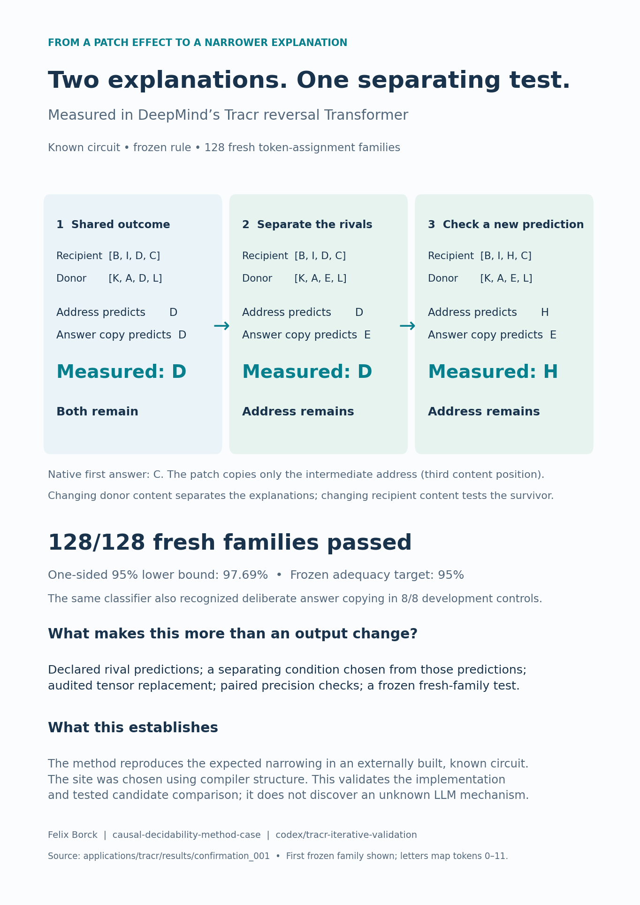

# Tracr: measured iterative narrowing

**Status: frozen fresh-family confirmation completed; records-only verification PASS.**
The claim concerns one known compiled reversal circuit and the two declared
interpretations of its address-subspace patch. The operator chose the site using
compiler structure, so the outcome was structurally expected. This is external
implementation/method validation, not discovery of an unknown LLM mechanism.



[One-page PDF](figures/tracr_narrowing.pdf).

## Fresh result

- **128/128** whole fresh families produced the qualified **2 → 1 → 1** trajectory.
- One-sided 95% finite-population lower bound: **0.97686761**; frozen adequacy threshold **0.95**. Decision: **adequate**.
- Required count was **126/128**. There was one final population test, no optional extension, no replacement families, and no per-stage statistical look.
- All required technical checks passed in **768** dtype-specific intervention records. These are not independent samples.
- Maximum paired fp32/fp64 full-score deviation: **2.244102293e-08**.
- Frozen numerical allowance **7.629394531e-06**, separate from scientific tolerance **0.01**; total radius **0.01000762939**.
- Development's deliberate final-output-copy control selected donor-answer copying in **8/8** families. It is a separate technical positive control, not another fresh population claim.

## The first frozen family (not selected by effect size)

Letters are a display mapping of numeric vocabulary 0..11.

| Step | Recipient | Donor | Address predicts | Answer copy predicts | Measured |
|---|---|---|---|---|---|
| 1 | [B, I, D, C] | [K, A, D, L] | D | D | D |
| 2 | [B, I, D, C] | [K, A, E, L] | D | E | D |
| 3 | [B, I, H, C] | [K, A, E, L] | H | E | H |

The initial observation leaves both candidates compatible. A donor-content change
preserves the transferred address but changes the donor's answer, separating the
predictions. The final recipient-content change checks the surviving rule. That
third row is a within-family predictive check; the population claim comes from
the 128 entirely fresh families, not from counting three rows per family.

## Controls and provenance

Maximum qualification errors across the fresh run:

```json
{
  "insert_error": 0.0,
  "complement_error": 0.0,
  "native_site_error": 0.0,
  "donor_source_error": 0.0,
  "noop_score_error": 0.0,
  "self_score_error": 0.0
}
```

Residual arithmetic uses fp32/fp64, including parameter rounding. The upstream
unembedding matrix produces float64 scores in both modes. These are compiled
projection scores, not nats. Higher precision is a reference, not exact truth.
The source/donor state, source and target position, full subspace, post-cast values
and unchanged complement are bound to stored tensors. Independent upstream-forward
tests also qualify the wrapper, and a model-free verifier recomputes the decisions.

- Upstream: `9ce2b8c82b6ba10e62e86cf6f390e7536d4fd2cd`.
- Freeze: [CONFIRMATION_FREEZE.json](CONFIRMATION_FREEZE.json), committed before confirmation.
- Fresh summary: [summary.json](results/confirmation_001/summary.json).
- Full trajectories: [trajectories.json](results/confirmation_001/trajectories.json).
- Verification: [verification.json](results/confirmation_001/verification.json).
- Development selected for freeze: [development_004](results/development_004/summary.json).
- Raw tensor snapshots and scores live alongside each summary; the summary binds them by SHA256.

Validation before confirmation: **99 application tests passed** (adapter, design,
finite-population statistics and adversarial artifact/runner checks), plus **89
existing repository tests**. The independent records-only verification recomputed
all 128 family decisions without a model forward. The one-page PDF was rendered
and visually checked; report generation does not alter frozen executable sources.

The runner recorded 3294 analysis forward calls
({'native': 990, 'noop': 768, 'patch': 768, 'self_patch': 768}; compiler initialization is excluded from that count)
in 5.29 seconds including compilation and controls on the
recorded CPU. This measured small-circuit runtime
is not an estimate for pretrained LLM experiments.

## Development history and limits

The original technical smoke and eight development families were disclosed before
confirmation. Development_001 predates stronger donor/source and inventory audits;
development_002 stopped on an overbroad bytecode/source check before outcomes;
development_003 was re-executed after final pre-freeze execution guards. These are
preserved and not counted as independent confirmations. Development_004 passed the
final unchanged surface. Fresh families were generated once, frozen and committed,
then measured without changing the sources or thresholds.

There are two substantive limits. First, the known address site makes the expected
answer analytically clear to the informed operator. This verifies a controlled
external path through the methodology, not unique natural-mechanism discovery.
Second, fresh token assignments retain the same program, length, intervention and
role structure. They do not establish performance on different algorithms, learned
representations, close continuous rivals, or a generally optimal adaptive policy.
The two-option selection menu ties in separation score; a fixed tie break chooses
one. No advantage over a strong fixed design is claimed.

## Next useful extension

Freeze a second compiled program or multiple opaque intervention sites whose roles
the inference code does not receive, including equivalent and out-of-set cases.
Measure false exclusions, correct retention and abstention by difficulty. A later
pretrained-model application tests transfer beyond the controlled compiler setting.
