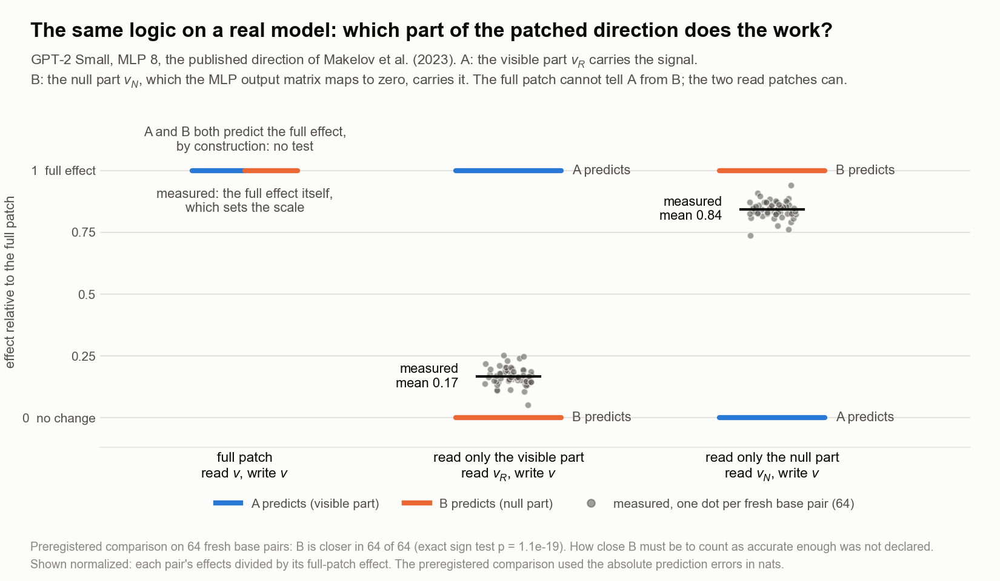

# A patch that works: which input supplies its signal?

**One intervention effect can fit different explanations. A second intervention can
make their predictions disagree.** This example executes that comparison on GPT-2 Small,
using the direction published by [Makelov, Lange and Nanda](https://arxiv.org/abs/2311.17030).
Their paper identified the interpretability illusion. This application makes the rival
predictions explicit and confirms a comparison on fresh cases.

## What changes in the experiment?

The model completes a name-based sentence. A patch reads a number from the difference
between a donor and recipient's internal activations, then writes an activation change
along a fixed direction. The measured outcome is the difference between the two answer
logits, not a claim about subjective experience or linguistic meaning.

At MLP 8, split the read direction into two parts:

- **Visible:** the immediate output projection can transmit it.
- **Null:** that projection maps it approximately to zero.

Keep the **write direction fixed**. Change only which part supplies the number being
written. This matters: reading null-space information and writing it into a visible
direction can create an effect the unmodified computation would not produce that way.

## What do the rivals predict?

| Condition | A: visible read supplies the signal | B: null read supplies the signal |
|---|---|---|
| Full patch | Measured full-patch result | Measured full-patch result |
| Read visible, keep full write | Full-patch result | Baseline result |
| Read null, keep full write | Baseline result | Full-patch result |

Baseline and full-patch measurements are **anchors from the same case**. Both candidates
fit the full patch by construction; only the two added read conditions test them.
These are two idealized endpoint candidates, not an exhaustive list of mechanisms.

## What happened on fresh data?

The comparison rule was frozen before 64 new base pairs were evaluated. Each pair includes
both swap directions; those directions are kept together as one statistical unit.
The loss is absolute prediction error, formed before averaging across conditions.

**B predicted better in all 64 pairs**, with no ties. The prespecified exact two-sided
sign test gives **p = 1.0842 × 10⁻¹⁹**, under its independent-pair and null win-probability
assumptions. Mean prediction errors were 1.2225 nats for A and 0.2383 for B; the means
were reported, not used as a separate pass/fail criterion.



No adequacy tolerance was declared. B is the better predictor here, not a demonstrated
complete or unique mechanism. The visible read also changes the output. The figure
normalizes effects for display; the confirmed test uses errors in nats.

## Check it, then reuse the method

From the repository root:

```bash
python3 examples/confirmed_read_source.py
```

This verifies archived hashes, pair structure, controls and the primary result, then
checks that the current method reproduces the frozen comparison. It needs no model
or third-party package. [Verification scope](../applications/makelov-2311.17030/RECORDS_ONLY.md)
separates this from a new model run. The original freeze has a consistent private
version history but no external contemporaneous timestamp; this release does not add one.

To apply the method: specify candidates, find a condition where predictions differ,
check measurement resolution, and freeze the comparison before fresh outcomes.
Use the [data contract](USING_THE_METHOD.md). The same workflow can preserve ambiguity
or reject every declared candidate; it cannot test an explanation nobody specified.
