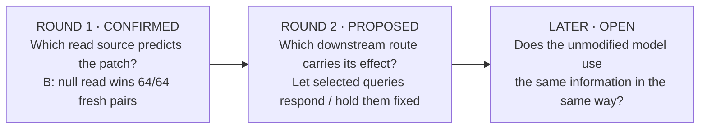

# Use the same method again: from a signal source to a downstream route

**Execution update:** the revised five-condition experiment has now run. Read the
[192-pair result](ROUND2_RESULT.md): all three declared profiles were excluded under
the frozen adequacy rule. The proposal below is retained as design history.

**Round 1 has a confirmed result. Round 2 below is a proposed experiment, with an
executable teaching example—not a second model result.**

**Critical design update:** the [reviewed round-2 plan](ROUND2_RESEARCH_PLAN.md) adds
the reverse query transfer. The four-cell proposal below cannot distinguish queries
carrying the effect from queries enabling a separate patch effect; the additional cell
tests that distinction. The teaching demo has not yet been extended.

The method is iterative: keep what a test established, identify the next unresolved
distinction, and design an intervention on which the new explanations disagree. A
successful first comparison does not automatically identify the whole mechanism.



## 1. Keep the first result, change the question

The [Makelov comparison](CONFIRMED_CASE.md) kept the patch's write direction fixed and
varied its read source. The null-read candidate predicted the interventions better in
all 64 fresh base pairs. This is a relative prediction result, not proof that it is the
only source or accurate enough. That result remains in place whatever round 2 finds.

The next question is **how the resulting perturbation reaches the output**. We propose
following the existing **null-read, full-write** arm. This is a choice of intervention
to study, not a claim that this arm is identical to the full patch.

## 2. State two new, deliberately narrow explanations

| Candidate | Ordinary patch | Patch with selected queries held at their original values |
|---|---|---|
| **Q: effect removed by the query clamp** | Reproduces the measured patch effect | Predicts no remaining patch effect |
| **B: effect preserved under the query clamp** | Reproduces the measured patch effect | Predicts the original patch effect remains |

The ordinary patch is the shared measured anchor. It does not test this distinction.
The additional condition does, provided the ordinary effect is large enough to resolve.

These operational candidates do not exhaust all possible mechanisms. A partly reduced,
reversed or amplified effect may fit neither. A preserved effect could reflect redundant
or compensating routes; it would not prove that the selected queries never participate.

## 3. Add one separating manipulation

The proposed target is the **last-position query of each of three Name Mover attention
heads** in GPT-2 Small: 9.6, 9.9 and 10.0 (zero-based). The paper motivates these heads
as readers of name-position information. This is a follow-up at a known candidate
route, not a newly discovered circuit. [Makelov et al., §5.1](https://arxiv.org/html/2311.17030v2#S5.SS1)

Cache those queries from the same recipient's ordinary, unpatched run. During the
intervention run, insert these baseline queries at that position. Keep other queries
untouched, and let keys, values and subsequent computation respond normally.

This tests **the patch-induced change in those queries**. It does not silence the heads,
freeze their attention outputs, or block every route through them. In particular, their
keys or values may still change.

Cross the patch and clamp to obtain four measurements on every directed pair:

| | Queries free | Queries restored to recipient baseline |
|---|---|---|
| **Patch off** | `Y00` | `Y01` — identity control |
| **Patch on** | `Y10` | `Y11` — separating condition |

Record the answer-logit margin in every cell. Then calculate:

```text
T = Y10 − Y00       original patch effect
R = Y11 − Y01       patch effect remaining under the query clamp
K = T − R          change in the patch effect caused by the clamp
```

The separate baselines prevent an additive clamp offset from masquerading as removal
of the patch effect. They do not eliminate interactions, distribution shift or general
loss of response sensitivity; those require controls.

## 4. See the distinction with numbers

**Invented teaching values, not measured LLM results:** suppose the ordinary patch
changes the margin by 2 nats.

| New observation | What the two endpoint candidates say |
|---|---|
| Remaining effect `R = 0` | Matches Q's endpoint |
| Remaining effect `R = 2` | Matches B's endpoint |
| Remaining effect `R = 1` | Could rule out both endpoints if measured precisely enough |
| Uncertainty spans both endpoints | The experiment has not resolved the comparison |
| An insertion or precision control fails | No mechanistic reading is licensed |

Run the same design logic and inspect every cell:

```bash
python3 examples/iterative_path_test.py
```

The demo uses the repository's design functions and constructed four-cell worlds. Its
tolerance and per-cell error bounds are **teaching assumptions**, not estimates, power
calculations, or thresholds approved for GPT-2. It does not load a model or turn old Q1
records into new evidence about the route.
Its conservative resolution gate is a demonstration convention: failing it is not proof
that no other analysis could resolve the case.

## 5. What the next real run would need

The [draft experiment plan](../applications/makelov-2311.17030/PATH_TEST_PLAN.md) specifies
the proposed hooks, controls, independent unit and inference targets. A technical pilot
must verify the query restoration, usable patch effects, response-sensitivity controls
and numerical resolution. Then freeze the comparison and test on fresh base pairs.

For a **relative comparison**, compare `|R|` with `|R − T|`, taking absolute errors before
averaging the two reciprocal directions within a base pair. A prespecified sign test can
ask which candidate wins more pairs, just as in round 1. For **adequacy**, additionally
justify tolerances and a calibrated uncertainty rule before confirmation. Better does
not mean adequate, and a non-significant difference does not mean equivalent.

The additional claim, if supported, would be: **restoring these selected queries removes
or preserves a specified part of this patch effect under the tested conditions.** It
would still concern a constructed intervention. Demonstrating the native use of a
semantic variable remains a further question.
