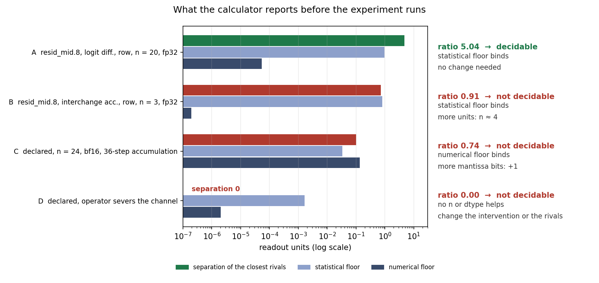

# Using the method with your own data

Start with the [illustrated method](../README.md) for the question, four steps and real-model
example. This guide provides the formal definition and practical evaluation contract.
For the shortest verified path, run `python3 examples/confirmed_read_source.py` from the
repository root. The [confirmed case](CONFIRMED_CASE.md) uses 64 fresh base pairs; the
default `from_data.py` example below uses the earlier 32-pair development pilot.

## A precise definition

Let `D` include the conditions, interventions and chosen quantities to be measured.
The prediction signature `s_D(H)` lists what candidate `H` predicts in every condition.
Candidates are design-equivalent when their signatures are identical. A structural
distinction exists when at least one entry differs.

Equality of predicted means establishes equivalence only for those means. The stronger
claim that **no test on the planned data** can separate two candidates requires identical
predicted distributions of those data.

## The steps in code

| Step | Function | What it returns |
|---|---|---|
| 1. Specify | a dictionary: candidate → predicted value, or a tuple with one value per condition | the prediction table |
| 2. Check the design | `signatures(predictions)`, `gains(predictions, base, extra)` | groups with the same declared predictions, and pairs an added condition separates |
| 3. Check measurability | `decidability(...)` before the run; `paired(a, b)` on the per-unit values after it | separation against a planned or measured resolution |
| 4. Compare predictions | `compare(data, candidates, tested, scope='pooled')` | paired comparisons of absolute predictive loss, without an adequacy tolerance |
| 3 + 4 on measured data | `evaluate(data, candidates, tested, loss, tolerance, scope)` | per candidate: excluded, adequate or undecided; the compatible set; pairwise comparisons |
| 4. Return the compatible set | `compatible_set(predictions, estimate, radius, equivalence_groups)` | the retained groups and one of four outcomes |

Step 2 needs no data and no statistics. `signatures` reports exact equivalence only;
`groups_within` chains candidates within a tolerance, which is a conservative summary and
proves no equivalence. Empirical comparisons need a test calibrated for the sample size
and null hypothesis actually used; interval-based adequacy and compatibility checks need
valid coverage. For small samples of discrete readouts use an exact test. Non-finite
values and empty candidate sets are refused as errors, never classified.

## The planning calculator (step 3)

**In**, before the run:

- the rivals' predictions for the estimand under the executed intervention, and the
  declared equivalence groups;
- the design: number of units `n`, the spread `sigma` of the per-unit contrast (from a
  pilot), the dtype, and the magnitude and accumulation depth of one readout value.

**Out**, before the run:

- **separation**: the smallest distance between the predictions of two rivals that are not
  declared equivalent;
- **resolution**: the statistical floor and the numerical floor, reported separately;
- **ratio** = separation / resolution, and the **lever** that would change it: more
  units, more precision, or a different intervention or set of rivals.



Two rules are kept apart:

- **Planning.** The ratio is a heuristic for whether a design is worth running. It is not
  a gate on what you may conclude afterwards.
- **Inference.** After the run, retain every rival whose prediction lies within the
  declared radius of the estimate. This rule can resolve a design the heuristic called
  marginal, and it can leave one the heuristic favoured unresolved.

The floors are combined by taking the larger. That is a planning convention, not an error
bound. The numerical floor comes from a rounding model, and it over-predicts measured
bfloat16 error by a median factor of about 27. Keep a measured precision check on the
final estimand.

The recommendation checks both floors. If both exceed the separation, adding units
alone or changing precision alone will not clear the planning threshold. A recommended
combination reports its projected floors and ratio; that remains a heuristic calculation,
not a power target. The precision model counts mantissa bits and does not certify that
an entire forward pass is safe in the suggested dtype: exponent range and measured
intervention fidelity still need checking.

The command below runs the calculator on design A in the figure, which comes from the
prospective `resid_mid.8` application:

```bash
causal-decide --prediction inert=0 --prediction carries_all=4.80 \
  --n 20 --sigma 1.52 --dtype float32 --readout-scale 20 --depth 768 \
  --noise-factor 1 --signatures 2
```

The procedure checks which **declared** rivals a design can distinguish and evaluates
their compatibility with observations. The calculator adds a provisional resolution
forecast. An explanation nobody wrote down is neither tested nor
excluded. A ratio above 1 is not a guarantee, and a ratio below 1 is not an impossibility
proof.

## From your own data

`examples/from_data.py` runs the whole path in one command: per-unit rows in; out come the
compatible set, the status of every candidate, and a direct comparison of each pair.

```bash
python3 examples/from_data.py --data my.csv --candidates my.json --tested cond_a cond_b \
    --loss absolute --scope pooled --tolerance 0.3
```

Candidates are written as predictions per tested condition: numbers, or
`"same_as:<condition>"`, which anchors a prediction to the unit's own measurement in
another condition. An anchored candidate reproduces its anchor by construction, so the
anchor condition cannot test it. The API refuses a tested condition such as
`probe: "same_as:probe"` before scoring.

For `compare` and `evaluate`, optional `equivalence_groups` declare aliases of the same
tested prediction rule. Their specifications must match; coincidentally equal measured
anchors are not enough. Each class is evaluated once and, for adequacy, counted once in
the multiplicity correction. If all candidates belong to one class there is no pairwise
comparison. The separate geometric `compatible_set` helper can conservatively join
declared nearby predictions; it does not certify that they are the same mechanism.

For an adequacy analysis, three declarations form the **contract**. They are fixed
together before confirmation outcomes are seen, and the script refuses to run the
adequacy analysis without them. A comparison alone needs no tolerance (see below):

| declaration | choices | what it decides |
|---|---|---|
| loss | `absolute`: mean absolute error per unit, formed before any averaging; `signed`: mean signed error | case-by-case prediction quality, or systematic deviation on average. Signed errors of +2 and −2 cancel; absolute ones do not |
| scope | per condition, or pooled over the tested conditions | where the loss is taken |
| tolerance | an absolute value with an independent justification, or a fraction of a reference gap | when a loss is small enough. A fractional tolerance is estimated from the same units, so it is resampled together with the loss |

The output keeps three statuses apart:

- **excluded:** the loss exceeds the tolerance, interval entirely above it;
- **adequate:** the loss is within the tolerance, interval entirely below it;
- **undecided:** the interval straddles it.

The compatible set is everything not excluded. Being the only candidate left is not the
same as being shown adequate. Fewer than ten units are refused.

**These statuses use nominal percentile-bootstrap intervals.** Ten units is an input
guard, not a coverage guarantee. Discrete, degenerate or rare-event data can invalidate
the intervals; multiplicity correction cannot repair that. Validate coverage under a
justified population model before interpreting an adequacy label as a controlled-error
claim. The confirmed Q1 example instead uses a single prespecified exact sign test for
relative prediction quality and makes no adequacy claim.

"Which candidate predicts better?" needs no tolerance at all:
`python3 examples/from_data.py --compare-only`, or `compare()`. On the per-unit absolute
loss it reports two tests with different questions and assumptions:

- the exact **sign test** asks how often each candidate wins a case. Ties are dropped. It
  assumes independent units and, under the null, that an untied unit favours either
  candidate with probability one half on average. That probability need not be the same
  for every unit: if it varies, the two-sided test is conservative
  ([Hoeffding 1956](https://doi.org/10.1214/aoms/1177728178), Theorem 5);
- the **sign-flip test** asks about the mean loss difference, and is exact only if the
  per-unit differences are symmetric about zero under the null. Equal expected losses do
  not imply that symmetry.

A nominal bootstrap interval of the mean difference is reported beside both. Declare which
test is primary before the data. Pairwise p-values are unadjusted; predeclare the error
family and correction if several comparisons are used for claims. With all ties, the
sign test reports p = 1 and no untied units; this does not establish equivalence.

A tolerance is a declared precision requirement, not a mechanism share. For example,
"within half the full effect" of each endpoint does not mean "carries more than half of
the mechanism": after nonlinear processing the separate read effects need not add up to
the full effect. With read effects of 0.2 and 0.2 on a full effect of 1, neither endpoint
fits.

Without arguments the script runs the stored Makelov read-source pilot, with the pilot's
own loss (absolute, pooled). At a tolerance of 10 % of the full effect both candidates are
excluded. At 25 %, the null-read explanation is shown adequate and the visible-read one is
excluded. Every one of the 32 units favours null read. These are illustrations on
development data; a confirmation declares its tolerance first.

Read the [worked example](WORKED_EXAMPLE.md) next. The
[evidence map](EVIDENCE_MAP.md) separates demonstrated distinctions from open validation
questions; [validation details](validation.md) report the current calculator's limits.
