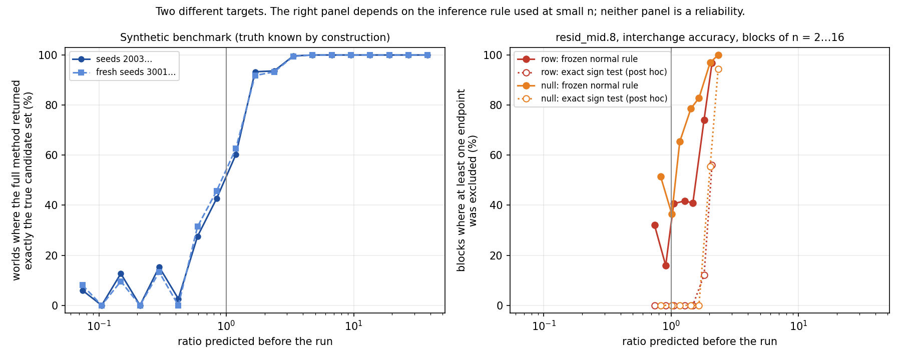

# Validation

Two kinds of evidence, each on its own branch with the code, the frozen inputs and the
outputs as they were produced.

This is a historical validation report, not a claim that the public snapshot contains
every development branch. The Makelov application is included; the full synthetic
benchmark is not. Its reported limitations are retained here, and this release does not
re-run it or present the current planning guidance as newly calibrated. The independently
checkable first case is the [64-pair Q1 comparison](CONFIRMED_CASE.md).

## 1. Synthetic benchmark: branch `validation/synthetic-benchmark`

**Setup.** 17,555 synthetic worlds per seed set, each with a known mechanism, so the
true set of compatible rivals comes from the construction and never from the method.
There are no model forward passes, and the numerical errors come from real torch casts.
The world generator was frozen by hash before the checks were written, and a test asserts
that hash. There are two seed sets: the declared held-out set (2003, 2011, 2017, 2027) and
a fresh set (3001, 3011, 3019, 3023) that was never evaluated before the final rule was
fixed.

**Criteria, declared before the run, and results** with the corrected calculator:

| | seeds 2003… | seeds 3001… | threshold | |
|---|---:|---:|---|---|
| D1: pre-run verdict matches the outcome | **88.47 %** | **88.20 %** | ≥ 90 % | **missed** |
| D2: error rate of the full method where called decidable | 0.0 % | 0.0 % | ≤ 1 % | met |
| D3: error rate of point-estimate practice where called undecidable | 40.39 % | 41.72 % | ≥ 20 % | met |
| D5: declared equivalence group split | 0 | 0 | = 0 | met |
| D4: width of the error transition | not evaluable | not evaluable | | the full method's error rate is 0 in every bin |

A post hoc, fairer comparator gives point-estimate practice the same group rule. Its
error rate where the calculator says undecidable is **24.37 % / 24.27 %**.

**Why D1 missed.** An earlier run reported 91.38 % / 91.48 %. That calculator listed 8
stored mantissa bits for bfloat16 instead of 7, which halved the bfloat16 numerical floor.
With the constant corrected, 840 pre-run verdicts per seed set flip from decidable to not.
In 675 of those 840 worlds the method in fact resolved the case completely and correctly.
The rounding model behind the numerical floor over-predicts the measured error there by a
median factor of about 27, and the halved constant had been masking that. The formula has
not been refitted: tuning it after seeing the score is what the procedure exists to
prevent. A recalibrated numerical floor is a new hypothesis that needs its own frozen test.

**Three outcomes, not two.** Worlds per seed set, split by the pre-run verdict:

| | called undecidable, ratio ≤ 1 (6,216) | called decidable, ratio > 1 (9,144) |
|---|---|---|
| fully resolved | 1,274 / 1,324 | 8,394 / 8,396 |
| partially resolved, truth retained | 1,903 / 1,700 | 664 / 669 |
| no claim | 3,039 / 3,192 | 86 / 79 |

Another 2,195 worlds per seed set have zero separation, and none of them is resolved.

**Reach.** These are measured rates over a declared family of synthetic worlds. The class
proportions are a property of the grid, not a frequency in the literature. No error-based
threshold is identified, because the full method's error rate is zero everywhere.

## 2. Prospective test on a real model: branch `applications/makelov-2311.17030`

**Setup.** GPT-2-small, float32, residual stream at the middle of layer 8, last position.
The direction is the DAS direction `das_resid_mid.joblib` published by Makelov, Lange &
Nanda (arXiv:2311.17030); no evaluation of it was found in the paper, the saved metrics
or the saved notebook outputs. It is split into the part inside the row space of the
name-mover queries and the part outside it. Two endpoint rivals per component: *inert*
(`E(X) = 0`) and *carries all* (`E(X) = E(full)`). Two readouts: logit difference and
interchange accuracy.

**Chain.** Each step was committed before the next one ran:

1. Freeze A: rivals, readouts, contrasts, seeds and the success criterion.
2. A dated clarification, and the blinded pilot code. The pilot may output only
   `mean E(full)` and the SDs of the paired contrasts, never where `E(row)` or `E(null)`
   lies.
3. Freeze B: 28 predictions from the pilot (2 components × 2 readouts × 7 sample sizes),
   and a confirmation runner that refuses to start unless the predictions file has its
   pinned hash.
4. The confirmation run: 2,000 fresh pairs, none shared with the pilot.

The commits bind the versions to each other. They are not an external timestamp.

**Result.** **28 / 28 predicted verdicts matched the frozen rule, with no miss outside the
[0.5, 2] band. The frozen criterion calls that supported.**

**What that result is, and is not.**

- The 28 checks are four series on seven *nested* sample sizes of the same data, not 28
  independent tests.
- Every prediction was "decidable", at ratios from 2.34 to 50.4, so a constant prediction
  of "decidable" would also have scored 28 / 28. The test could catch the calculator
  overpromising on real data. It could not show that it flags a design as too weak.
- "Decided" under the frozen rule means *at least one endpoint excluded*. What the rule
  actually left standing:

  | endpoints still compatible | checks |
  |---|---:|
  | neither: both rivals excluded | 21 |
  | only *inert* (interchange accuracy, null component, n = 20 … 1000) | 6 |
  | only *carries all* (interchange accuracy, row component, n = 20) | 1 |
  | both | 0 |

  So the procedure mostly established that **neither declared endpoint explanation
  fits**. "Not excluded" is not a positive confirmation of that endpoint.
- The smallest size in the ladder already decided everywhere, so the transition is not
  located by the primary test.
- The 14 primary checks on interchange accuracy also decide under an exact two-sided sign
  test at 0.005 per endpoint (a post hoc sensitivity check).

**Secondary, added at Freeze B and not judged: a diagnosis of the inference rule, not a
calibration curve.** For interchange accuracy, disjoint blocks of n = 2 to 16 pairs put
the predicted ratio between 0.74 and 2.34. The frozen rule, a normal interval built from
the sample SD, is not calibrated on such small samples of {−1, 0, 1} values. If the values
are ±1 with probability ½ each, so the true mean is 0, it wrongly excludes 0 with
probability 50 % at n = 2, 25 % at n = 3, 3.9 % at n = 12 and 2.1 % at n = 16, against a
nominal 0.5 %. The block rates therefore depend on the rule:

| component, n | ratio | frozen normal rule | exact sign test (post hoc) |
|---|---:|---:|---:|
| row, 2 … 8 | 0.74 … 1.48 | 16–42 % | 0 % |
| null, 2 … 8 | 0.83 … 1.65 | 37–83 % | 0 % |
| row, 12 | 1.81 | 74.1 % | 12.0 % |
| null, 12 | 2.02 | 97.0 % | 55.4 % |
| row, 16 | 2.09 | 96.8 % | 56.0 % |
| null, 16 | 2.34 | 100 % | 94.4 % |

The exact test is conservative: it cannot exclude anything with fewer than 9 discordant
pairs. Neither column is the rate of *reliable* decisions, and the blocks cannot say
where decisions become reliable on this site.

**The answer at this site** was secondary and not used to judge the method. At
n = 2,000 both endpoints are excluded for both components on both readouts. The separate
row-space patch achieves 86 % (logit difference) and 75 % (interchange accuracy) of the
mean effect of the full patch; the null-space patch achieves 15 % and 0.8 % (12 of 2,000
pairs flip, none flip back; exact p = 0.0005). These are ratios of effects, not shares of
a mechanism. The patch along `v` is not the sum of the patches along its two parts (it
has cross terms between what it reads and what it writes), and the network downstream is
nonlinear. On interchange accuracy the two single-patch effects add up to only 76 % of
the full one. Nor does it follow that both components are needed.

The left panel counts worlds where the full method returned exactly the true set. The
right panel counts blocks where at least one endpoint was excluded, which includes
excluding both, and it has no mechanistic ground truth. Their similar shape does not
mean the same performance.

## What is not validated yet

- **The undecidable side, prospectively.** No preregistered prediction so far was "not
  decidable".
- **Calibration at small n.** The calculator assumes a known sigma and a normal model; the
  realized rule used the sample SD. Where they diverge, on small samples of discrete
  readouts, neither the prediction nor the realized decision is trustworthy without an
  exact or otherwise calibrated interval.
- **The numerical floor.** It over-predicts measured bfloat16 error by a median factor of
  about 27 in the synthetic benchmark. It has never been tested on a real model.
- **Generality.** One model, one site, one paper.

## What the next prospective test must fix first

Choosing sample sizes on both sides of ratio 1 is necessary but not enough. Before the
next Freeze A:

1. Decide what a "decision" is supposed to predict: any exclusion, the correct candidate
   set, or identification of a relevant effect. Keep "no candidate fits" as its own
   outcome.
2. Use a realized rule whose coverage holds at the chosen n (exact tests for discrete
   readouts), and a matching prediction (for binary readouts, exact power rather than the
   normal floor).
3. Fix a rule that picks sizes from the pilot, so that both weak and strong designs occur,
   and score it against a simple baseline such as the constant prediction.
4. Measure decision frequency and wrong decisions on separate confirmation blocks, not
   nested prefixes.
5. Timestamp each freeze externally at the moment it is made, for example with a public
   push or a registry entry. Publishing a private history later does not do this.
